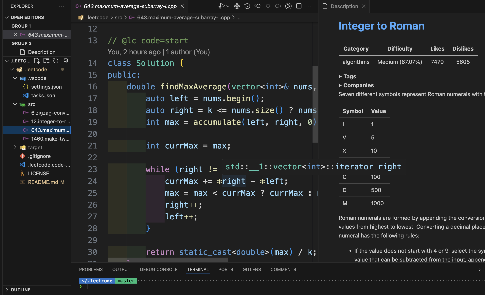

# Config Profile for C++ DS&A Practices With VSC LeeCode Extension and

## Features

Local C++ Run and Debug for LeetCode Practices, submission and question display within VSC.

## Requirements

- Visual Studio Code
- One C++ Compiler: g++, clang++ ...
- [LeetCode Extension for Visual Studio Code](https://marketplace.visualstudio.com/items?itemName=LeetCode.vscode-leetcode)

## Structure

- /src: C++ source code files
- /target: build artifacts
- /.vscode: Visual Studio Code configuration files
